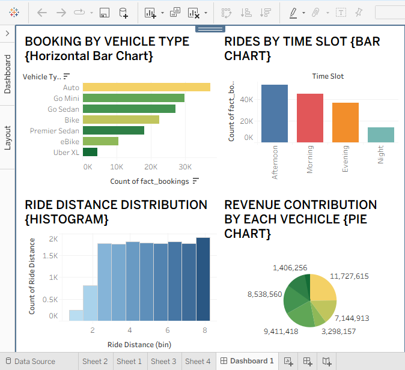

# 📊 Data Analytics Internship Project

## 👩‍💻 Name
**Pushyami B**

---

## 📌 Project Overview
This project consists of multiple tasks completed during the Data Analytics Internship at CodTech. It focuses on analyzing real-world ride data to extract meaningful insights using data analysis, visualization, machine learning, and sentiment analysis techniques.

The project demonstrates the complete data analysis workflow including data preprocessing, exploratory data analysis, dashboard creation, and predictive modeling.

---

## 🛠️ Technologies Used
- Python  
- Pandas  
- Matplotlib & Seaborn  
- Scikit-learn  
- Tableau Public  
- TextBlob (NLP)  
- GitHub  

---

## 📊 Dashboard Overview

The dashboard provides a comprehensive analysis of ride data using different types of visualizations:

### 🔹 Booking by Vehicle Type (Horizontal Bar Chart)
- Shows the number of rides for each vehicle type  
- Helps identify most preferred vehicle categories  

### 🔹 Rides by Time Slot (Bar Chart)
- Displays ride distribution across different time periods  
- Helps identify peak demand hours  

### 🔹 Ride Distance Distribution (Histogram)
- Shows frequency of rides based on distance  
- Indicates that most rides are short-distance  

### 🔹 Booking Value Contribution (Pie Chart)
- Represents contribution of each vehicle type to total booking value  
- Helps understand which categories generate higher value  

---

## 📸 Dashboard Preview

---

## 📁 Tasks Completed

### 🔹 Task 1: Exploratory Data Analysis (EDA)
- Cleaned and preprocessed dataset  
- Performed statistical analysis  
- Created visualizations to identify patterns  

### 🔹 Task 2: Machine Learning
- Built a regression model  
- Trained and tested using dataset  
- Evaluated model performance  

### 🔹 Task 3: Dashboard Development
- Designed interactive dashboard using Tableau  
- Combined multiple visualizations for insights  

### 🔹 Task 4: Sentiment Analysis
- Analyzed text data using NLP  
- Classified sentiments as Positive, Negative, Neutral  

---

## 📈 Key Insights
- Ride demand varies across different time slots  
- Certain vehicle types are more popular among users  
- Majority of rides are short-distance trips  
- Different vehicle types contribute differently to booking value  

---

## 🎯 Conclusion
This project provided hands-on experience in analyzing real-world data and building meaningful insights through visualization and machine learning.

It helped in understanding the complete data analysis pipeline and improved skills in Python, data visualization, and analytical thinking.git add .
